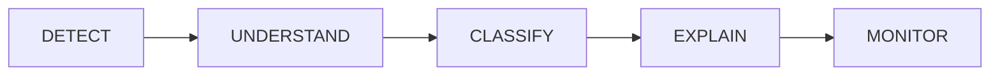

<div align="center">
  
# 🔥 Agnidrishti (अग्निदृष्टि)
**AI-Enabled Geospatial Thermal Intelligence & Monitoring System**

[](#)
[-success.svg)](#)
[](#)
[](#)
[](#)

Agnidrishti is a cutting-edge geospatial thermal-intelligence prototype engineered for **Smart India Hackathon 2026 (Problem Statement SIH26162)**.

Going beyond mere thermal hotspot plotting, Agnidrishti investigates anomalies using thermal, temporal, industrial, land-cover, and satellite contexts to intelligently classify and interpret thermal events.

</div>

---

## 📖 Core Product Principle

Agnidrishti functions as the intelligence layer over raw thermal detections (e.g., NASA FIRMS). Our pipeline is built on a clear, explainable philosophy:



## 🎯 System Architecture & Pipeline

The end-to-end processing pipeline transforms raw satellite detections into actionable intelligence:

1. **Thermal Ingestion:** NASA FIRMS NOAA-20 / NOAA-21 data streams.
2. **Contextual Analysis:** 
   - *Temporal Persistence:* Identifying repeated vs. transient heat.
   - *Industrial Context:* Proximity to refineries, factories, and mines via OpenStreetMap.
   - *Land-Cover:* Built environments, forests, or agriculture.
   - *Satellite Evidence:* Sentinel-2 spectral and contextual indicators.
3. **Feature Fusion & ML Classification:** Categorizing into Probable Industrial Fire, Flare Activity, Agricultural Burning, etc.
4. **Explainability & Scoring:** Probabilistic outputs explaining the reasoning behind the thermal anomaly score.
5. **GIS Dashboard:** An interactive intelligence dashboard for real-time monitoring.

---

## 🚀 Getting Started

Follow these steps to set up the **Phase 0 Foundation** locally. This phase runs in **Fixture Mode**, utilizing mock datasets to simulate the end-to-end application flow without external APIs.

### Prerequisites

- **Node.js:** `>=20.0.0`
- **Package Manager:** `pnpm`
- **Python:** Managed via `uv` (Astral)

### Installation & Execution

1. **Clone the repository:**
   ```bash
   git clone https://github.com/YourOrg/agnidrishti.git
   cd agnidrishti
   ```

2. **Install Workspace Dependencies (Frontend):**
   ```bash
   pnpm install
   ```

3. **Install Backend Dependencies:**
   ```bash
   cd services/api
   uv sync
   cd ../..
   ```

4. **Run the Application Services:**
   Open two separate terminal instances to start the frontend and backend.
   
   **Terminal 1 (Backend API):**
   ```bash
   pnpm dev:api
   # API running at: http://localhost:8000
   # Swagger Docs: http://localhost:8000/docs
   ```

   **Terminal 2 (Frontend UI):**
   ```bash
   pnpm dev:web
   # Dashboard running at: http://localhost:3000
   ```

---

## 🗺️ Development Roadmap

We adopt a phased execution approach. Phase 0 is currently finalized and verified.

| Phase | Milestone | Description | Status |
| :---: | :--- | :--- | :---: |
| **0** | **Foundation / Architecture** | Repo structure, Next.js + React-Leaflet GIS shell, FastAPI backend, fixture data flow. | 🟢 **Verified** |
| **1** | **NASA FIRMS Ingestion** | Replace fixtures with live FIRMS NOAA-20 / NOAA-21 detections. | ⏳ **Next** |
| **2** | **PostGIS Storage** | Normalize and persist data geospatially. | ⬜ Planned |
| **3** | **Temporal Intelligence** | Calculate persistence metrics for recurrent heat sources. | ⬜ Planned |
| **4** | **Industrial Context** | Integrate OSM data for surrounding industrial mapping. | ⬜ Planned |
| **5** | **Land-Cover Context** | Contextualize anomaly surroundings (forest, built, etc.). | ⬜ Planned |
| **6-8** | **Feature Fusion & ML** | Sentinel-2 integration and baseline ML classification. | ⬜ Planned |
| **9-10** | **Explainability & Scoring** | Model transparency and historical anomaly scoring. | ⬜ Planned |
| **11-14**| **Dashboard & Analytics** | Finalizing judge-facing GIS UI, monitoring trends, and SIH Demo mode. | ⬜ Planned |

---

## 🛠️ Phase 0: Verification State

The Phase 0 foundational slice is complete. The following features are live in the local environment:
- ✅ **Next.js 15 App Router** frontend scaffold with **React-Leaflet** integration.
- ✅ Dynamic Stats Cards & Analysis Drawer reflecting mock classifications.
- ✅ Interactive Dashboard with active filters (All, Industrial, Persistent).
- ✅ **FastAPI** backend routing mock fixtures to the frontend `/api/v1/endpoints/hotspots`.
- ✅ Resolved CORS and unified routing parameters.

> **Note to Contributors:** Ensure you can load `localhost:3000`, interact with the GIS map, open the analysis drawer without console errors, and access the FastAPI Swagger UI at `http://localhost:8000/docs` before proceeding to Phase 1.

---

## 📜 Development Guidelines & Governance

To maintain a high standard of quality suitable for the SIH internal shortlisting:

1. **Preserve Phase 0 Integrity:** Do not rewrite core architectural choices (e.g., React-Leaflet, FastAPI) unless backed by explicit project requirements. Make incremental, safe changes.
2. **Scientific Credibility:** Avoid "fake AI" metrics. Ensure all probabilistic classifications are supported by data logic (e.g., "probable industrial thermal event").
3. **Modularity:** Maintain decoupled integration with external providers (NASA FIRMS, OSM, Sentinel-2).
4. **SIH Focus:** Every feature must directly align with **Problem Statement 162**. Prioritize end-to-end functionality over unnecessary visual polish.

---

<div align="center">
  <p>Built with purpose for Smart India Hackathon 2026.</p>
</div>
